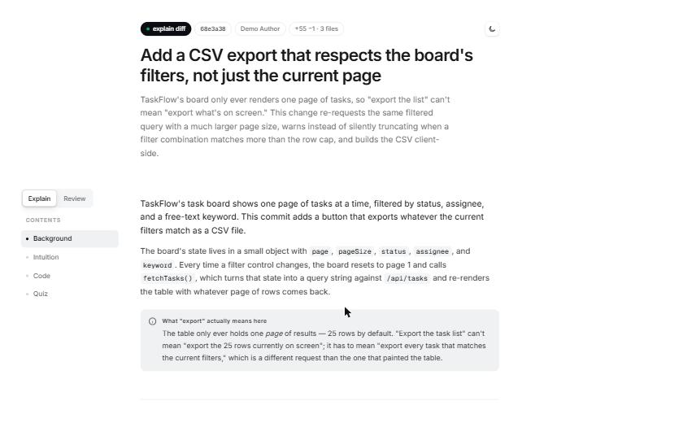
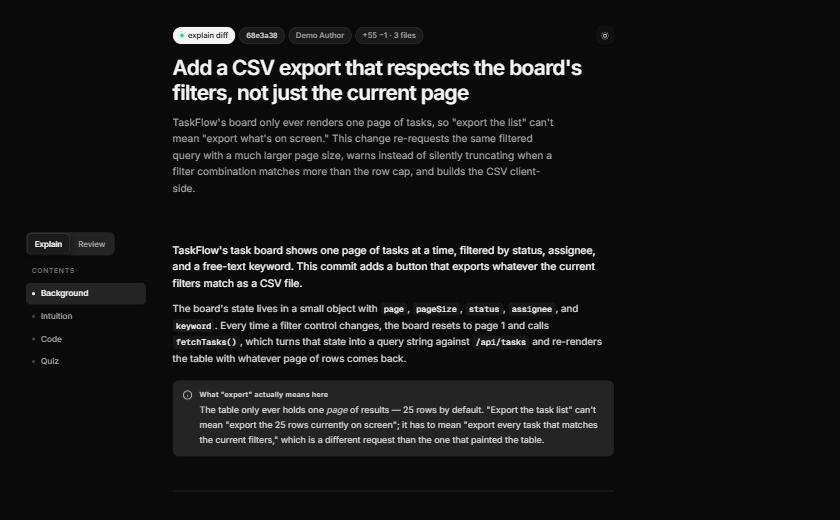
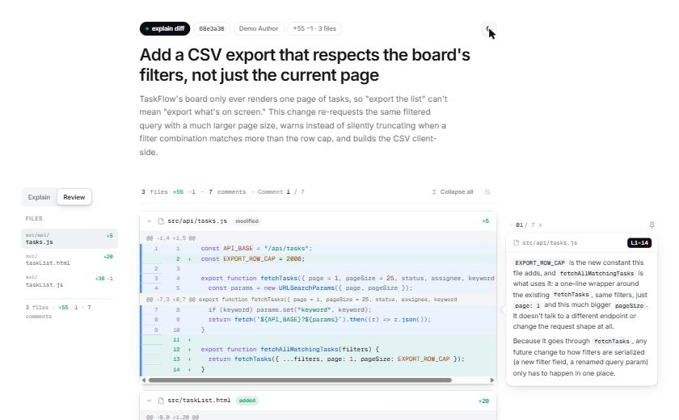
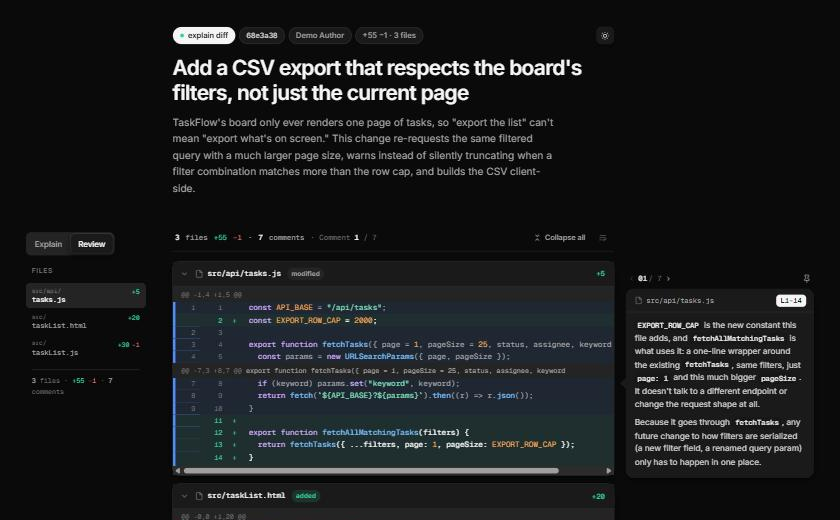

[English](./README.md) | **한국어**

# explain-diff-plus

변경된 코드 내역(diff·커밋·브랜치·PR)을 인터랙티브 HTML 페이지로 보여주는 스킬: 

**설명(Explain)** 탭: 
> Background → Intuition → Code → Quiz 순서로 전개되는 코드 변경에 대한 자세한 설명 

**리뷰(Review)** 탭: 
> 특정 줄에 앵커되는 인라인 코멘트가 있는 전체 diff.

- `SKILL.md`를 읽고 따라갈 수 있는 코딩 에이전트라면 어디서든 동작합니다 — Codex·Claude로 테스트했습니다.

<table>
<tr>
<td></td>
<td></td>
</tr>
<tr>
<td></td>
<td></td>
</tr>
</table>

## Geoffrey Litt의 explain-diff에서 영감을 받음

[Geoffrey Litt](https://github.com/geoffreylitt)의
[explain-diff gist](https://gist.github.com/geoffreylitt/a29df1b5f9865506e8952488eac3d524)
(`explain-diff-html.md`, 라이선스 미명시)에서 영감을 받았습니다. Background/Intuition/Code/Quiz
구성과 퀴즈 5문항 형식은 그 원본 아이디어를 이어받았고, SKILL.md·조립기·템플릿의 실제 문장·코드는
이 저장소에서 독자적으로 작성했습니다. 그 경계를 정확히 어디에 그었는지는
[`NOTICE.md`](./NOTICE.md)에 있습니다.

### 이 원본 아이디어에서 더 추가한 것:

- **리뷰 탭** 
  - 파일별 diff 아코디언 + 특정 줄에 앵커되는 코멘트 카드
  - `scripts/render_diff.py` — 실제 `git diff`를 읽어 페이지를 조립. 에이전트가 diff를 직접 HTML로
    옮겨 적을 필요가 없음
  - 라이트/다크 테마, 줄바꿈 토글, 탭별 스크롤 위치 기억
  - 코드블럭에서 드래그 선택 시 `file:line` 포맷으로 복사되는 복사버튼 
  - 페이지 정적 UI를 언어 설정 `--lang` 스위치(`en`/`ko`)
  - 글쓰기 가이드(일관된 어조, 문어체 아닌 타이틀, 코멘트 밀도/겹침 규칙)

## 사용법

1. 이 저장소를 에이전트가 스킬을 찾는 위치에 두거나, `SKILL.md`를 가리키고 그대로 따르라고
   지시합니다.
2. diff·커밋·PR을 설명해 달라고 요청합니다 — 사용하는 에이전트가 스킬을 트리거하는 평소 방식대로.
3. 에이전트가 `scripts/render_diff.py --repo <repo> --commit <sha> --list` 로 diff를 확인하고,
   설명 탭 본문과 리뷰 탭 코멘트를 작성한 뒤 `render_diff.py --lang <en|ko>` 로 페이지를 조립해
   엽니다.
4. 결과물은 `$EXPLAIN_DIFF_GALLERY` 가 설정돼 있으면 그곳에, 아니면
   `~/explain-diff-gallery/<project>/<branch>/` 에, 그것도 안 되면 OS 임시 폴더에 저장됩니다.

작업 순서, 섹션별 글쓰기 지침, 다이어그램·퀴즈 마크업, 코멘트 밀도, 정적 UI 언어와 본문 언어의
관계 같은 세부 규칙은 [`SKILL.md`](./SKILL.md)에 있습니다 (영문).

## 요구 사항

- Python 3 (표준 라이브러리만 사용)
- `git`

## 라이선스

MIT — [`LICENSE`](./LICENSE) 참고. 이 저장소에서 새로 작성한 것(조립 스크립트, 템플릿, 지침
문서)에 적용됩니다. 이 프로젝트가 영감을 받은 구조적 아이디어 자체를 재라이선싱하는 건 아닙니다 —
자세한 내용은 [`NOTICE.md`](./NOTICE.md)에 있습니다.
